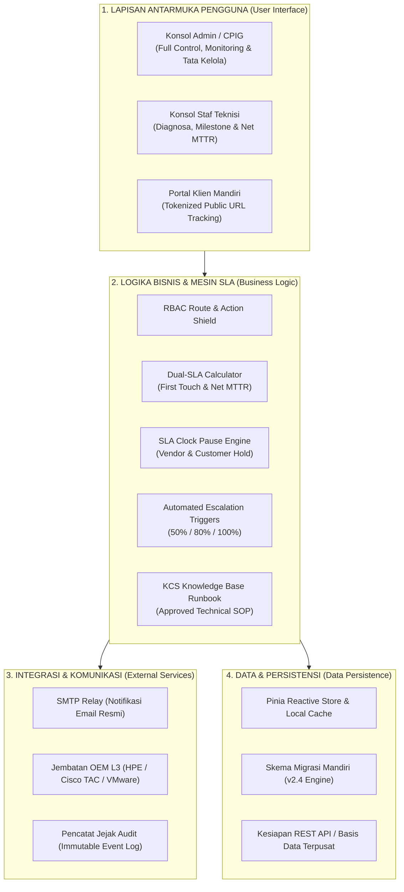
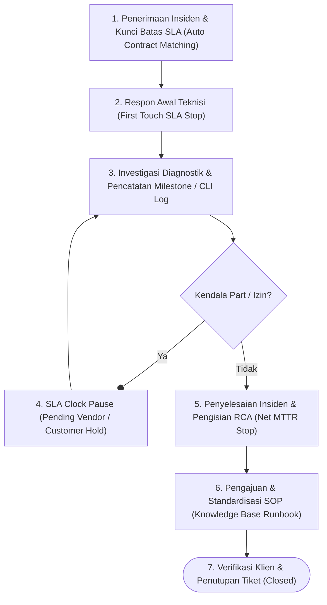

# SPESIFIKASI TEKNIS: ARSITEKTUR SISTEM & ALUR OPERASIONAL HELPDESK
## SISTEM HELPDESK TICKETING ENTERPRISE
### PT GLOBAL TRANSFORMASI TEKNOLOGI

---

| Parameter Dokumen | Keterangan |
|---|---|
| **Nomor Dokumen** | GTT-SPEC-ARCH-2026-01 |
| **Klasifikasi** | Internal Teknis - Terbatas |
| **Standar Rujukan** | ITIL v4 Service Operation & ISO/IEC 20000 |
| **Versi Rilis** | v2.4 Enterprise Architecture |
| **Tanggal Efektif** | 18 September 2026 |
| **Lingkup Infrastruktur** | Server, Storage SAN, Jaringan Enterprise, Virtualisasi & Database |

---

## BAB I: RINGKASAN SISTEM

Sistem Helpdesk Ticketing PT Global Transformasi Teknologi dirancang untuk mengelola dan memantau penanganan insiden infrastruktur IT pada 6 klien enterprise:
1. **PT Bank Central Asia, Tbk (BCA)** - Tier Platinum 24×7
2. **PT Astra Honda Motor (AHM)** - Tier Platinum 24×7
3. **Siloam Hospitals Group** - Tier Gold 8×5
4. **Diskominfo Pemerintah Provinsi Jawa Barat** - Tier Pemerintah Tier-1 (8×5)
5. **PT Telekomunikasi Selular (Telkomsel)** - Tier Platinum 24×7
6. **PT Bank Mandiri (Persero), Tbk** - Tier Platinum 24×7

Sistem mengotomatisasi penegakan kontrak tingkat layanan (*Service Level Agreement / SLA*), pencatatan rekam jejak diagnostik, koordinasi eskalasi teknis, dan standardisasi prosedur perbaikan ke dalam pustaka operasional terverifikasi.

---

## BAB II: DIAGRAM ARSITEKTUR SISTEM

Sistem menerapkan arsitektur 4 lapisan modular yang memisahkan antara antarmuka pengguna, pemrosesan logika bisnis, integrasi layanan eksternal, dan manajemen persistensi data:

### Rincian Tanggung Jawab Komponen

| Komponen Arsitektur | Deskripsi Teknis | Implementasi pada Sistem Helpdesk |
|---|---|---|
| **Lapisan Antarmuka** | Aplikasi SPA responsif dengan pemisahan tampilan berdasarkan profil kerja. | Dashboard metrik SLA, ruang kerja diagnosa tiket teknisi, serta portal status publik via URL token. |
| **Mesin Logika Bisnis** | Pemrosesan state terpusat, validasi alur tiket, kalkulasi otomatis SLA, dan penanganan pause. | Pinia stores, RBAC Route Guard, Dual SLA Engine, timer countdown berkala, dan evaluasi threshold eskalasi. |
| **Integrasi Layanan** | Saluran komunikasi resmi dan pencatatan riwayat operasional yang dapat diaudit. | Relai surel (SMTP) untuk notifikasi penugasan/update ke klien, referensi nomor kasus vendor L3, dan audit log. |
| **Persistensi Data** | Manajemen state lokal dan sinkronisasi struktur data runtime. | Penyimpanan reaktif dengan migrasi skema data otomatis (v2.4) untuk menjaga konsistensi state penanganan tiket. |

---

## BAB III: MATRIKS AKSES BERBASIS PERAN (RBAC)

Sistem membatasi wewenang operasional antara peran **ADMIN / CPIG** dan **SUPPORT ENGINEER** untuk menjaga tata kelola insiden, integritas data, dan pemisahan fungsi penugasan dengan fungsi eksekusi perbaikan:

| Modul / Tindakan Operasional | ADMIN / CPIG | SUPPORT ENGINEER | PORTAL KLIEN |
|---|:---:|:---:|:---:|
| Monitoring Dashboard SLA & Antrean Global | **Akses Penuh** | Pantauan Personal | Ditolak |
| Pembuatan Tiket Baru & Pemilihan Preset | **Akses Penuh** | Input Lapangan | Ditolak |
| Penugasan & Alokasi Ulang Staf Teknisi | **Kontrol Penuh** | Hanya Baca | Ditolak |
| **Salin Tautan Pelacakan Klien (Tokenized URL)** | **Akses Khusus** | Disembunyikan | Ditolak |
| **Pratinjau & Pengiriman Surel Notifikasi** | **Akses Khusus** | Disembunyikan | Ditolak |
| Pencatatan Milestone & Command Execution Log | Bisa Menambah | **Pelaksana Utama** | Ditolak |
| Pengajuan & Pencabutan Penahanan SLA (Pause) | Validasi / Cabut | **Pelaksana Utama** | Ditolak |
| Pengisian Analisis Akar Masalah (RCA) & Resolusi | Verifikasi | **Pelaksana Utama** | Ditolak |
| Konfigurasi Matriks SLA & Master Data Pelanggan | **Akses Penuh** | Ditolak (403) | Ditolak |
| Laporan SLA Eksekutif & Ekspor Laporan | **Akses Penuh** | Ditolak (403) | Ditolak |
| Pustaka Runbook Pengetahuan (Knowledge Base) | Persetujuan SOP | Ajukan & Membaca | Hanya Baca |

---

## BAB IV: ALUR OPERASIONAL SIKLUS HIDUP TIKET

Setiap insiden ditangani melalui 6 tahap operasional terstandarisasi:

### Rincian 6 Tahap Operasional:
1. **Pencatatan Insiden & Penguncian Batas Waktu SLA**: Laporan insiden dicatat oleh Helpdesk/CPIG. Sistem mengunci target waktu respon dan target resolusi secara otomatis sesuai klausul kontrak PKS klien (Platinum, Gold, Silver, atau Pemerintah). Tautan pelacakan dan notifikasi email dibuat secara otomatis.
2. **Respon Awal Teknisi (Response SLA Handshake)**: Teknisi bertugas mengonfirmasi penanganan dengan mengubah status tiket menjadi `IN_PROGRESS`. Tindakan ini menghentikan perhitungan *Response SLA* dan mencatat timestamp respon awal di dalam audit trail.
3. **Investigasi Diagnostik & Pencatatan Milestone**: Teknisi melakukan penelusuran masalah, pengujian teknis, dan perbaikan perangkat. Setiap tindakan teknis, sintaks perintah CLI, dan bukti tangkapan layar dicatat secara kronologis pada log milestone.
4. **Penahanan Jam SLA Resmi (SLA Clock Pause)**: Bila perbaikan tertunda akibat menunggu suku cadang vendor principal (*Pending Vendor*) atau menunggu izin jendela pemeliharaan dari pelanggan (*Pending Customer*), teknisi mengaktifkan status Pause dengan melampirkan nomor kasus vendor. Timer resolusi SLA dibekukan sementara.
5. **Penyelesaian Masalah & Analisis Akar Masalah (RCA)**: Setelah perangkat normal, teknisi mengisi formulir penyelesaian yang mencakup penyebab gangguan (*Root Cause*), langkah perbaikan (*Resolution*), dan rekomendasi pencegahan. Jam hitung resolusi SLA resmi dihentikan permanen.
6. **Standardisasi Prosedur (Knowledge Base Runbook)**: Solusi teknis yang efektif diajukan oleh teknisi ke modul Knowledge Base. Setelah diverifikasi dan disetujui oleh Administrator/Lead, prosedur tersebut dipublikasikan menjadi SOP resmi untuk penanganan insiden sejenis.

---

## BAB V: LOGIKA PERHITUNGAN SLA & ESKALASI

### 1. Formula Dual SLA Engine

#### A. Waktu Respon Awal (*First Touch SLA*)
$$\Delta T_{\text{respon}} = T_{\text{respon}} - T_{\text{dibuat}}$$
- **Kepatuhan:** $\Delta T_{\text{respon}} \le \text{Target Respon Kontrak}$

#### B. Waktu Resolusi Bersih (*Net MTTR SLA*)
$$\text{Net MTTR} = (T_{\text{selesai}} - T_{\text{dibuat}}) - \sum T_{\text{pause}}$$
- **Kepatuhan:** $\text{Net MTTR} \le \text{Target Resolusi Kontrak}$

---

### 2. Matriks Standar Kontrak Layanan (PKS)

| Tingkat Kontrak | Cakupan Waktu Layanan | Target Respon | Target Resolusi MTTR |
|---|---|:---:|:---:|
| **Platinum 24×7** | 24 Jam × 7 Hari Non-Stop | $\le$ 30 Menit | $\le$ 4 Jam |
| **Gold 8×5** | Senin – Jumat (08:00 – 17:00 WIB) | $\le$ 30 Menit | $\le$ 8 Jam |
| **Silver 8×5** | Senin – Jumat (08:30 – 17:30 WIB) | $\le$ 1 Jam | $\le$ 12 Jam |
| **Pemerintah Tier-1** | Jam Kerja Kantor Dinas Pemerintah | $\le$ 1 Jam | $\le$ 12 Jam |

---

### 3. Ambang Batas Pemicu Eskalasi Otomatis

| Tahapan Eskalasi | Ambang Batas Waktu | Tindakan Sistem Otomatis | Penerima Notifikasi |
|---|---|---|---|
| **Tahap 1: Peringatan** | 50% dari Target MTTR | Kirim email pengingat status pengerjaan tiket | Teknisi Bertugas & Lead SysOps |
| **Tahap 2: Kritis** | 80% dari Target MTTR | Kirim email prioritas tinggi & siagakan eskalasi principal L3 | Service Operations Manager |
| **Tahap 3: Pelanggaran** | 100% Target MTTR Terlampaui | Tandai status Breached, catat ke audit log, jadwalkan evaluasi | Manajemen & Komite Operasional |

---

## BAB VI: LEMBAR PENGESAHAN DOKUMEN

Dokumen spesifikasi teknis arsitektur sistem dan alur operasional helpdesk ini dinyatakan sah sebagai acuan teknis operasional PT Global Transformasi Teknologi:

 

| Disusun Oleh, | Ditinjau Oleh, | Disahkan Oleh, |
|:---:|:---:|:---:|
|    **Rina Anggraini** Lead Helpdesk & CPIG Operations |    **Ir. Hendra Gunawan** Service Operations Manager |    **Ahmad Fauzi** Head of IT & Infrastructure |
