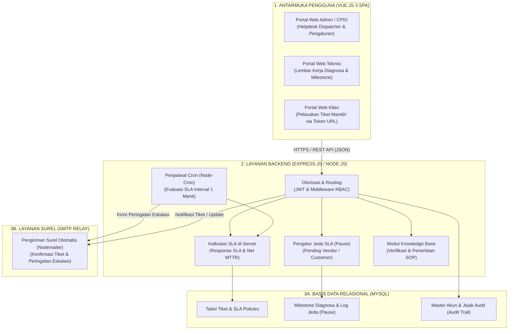
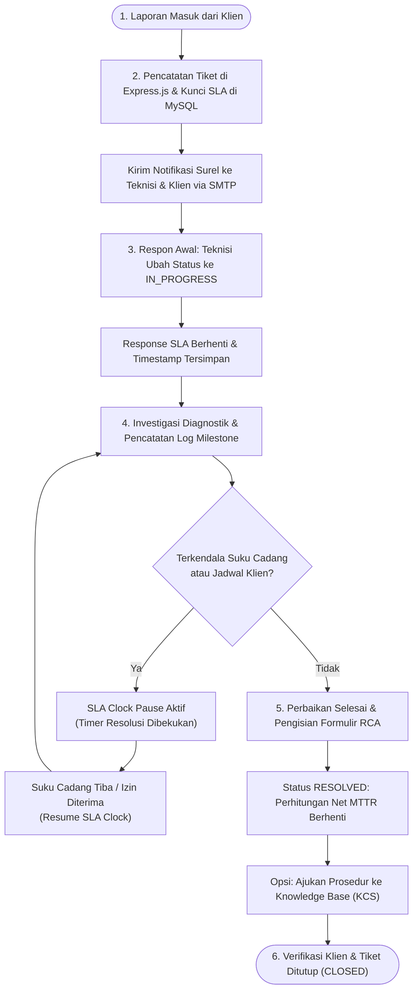

# RANCANGAN ARSITEKTUR, MATRIKS AKSES, DAN ALUR SISTEM HELPDESK TICKETING

Dokumen spesifikasi teknis ini memuat rancangan arsitektur perangkat lunak *full-stack*, matriks kontrol akses berbasis peran (RBAC), diagram alur proses (*flowchart*) siklus hidup penanganan insiden, serta formula dan matriks perhitungan *Service Level Agreement* (SLA).

---

## DAFTAR ISTILAH DAN SINGKATAN

| Singkatan | Istilah Lengkap | Penjelasan Fungsi dalam Sistem |
|---|---|---|
| **CPIG** | *Customer Problem Incident Group* | Staf *Helpdesk & Dispatcher* yang menerima keluhan, menerbitkan tiket, mengalokasikan teknisi, dan berkomunikasi dengan klien. |
| **SLA** | *Service Level Agreement* | Kesepakatan batas waktu layanan penanganan insiden yang mengikat secara kontraktual. |
| **MTTR** | *Mean Time To Resolve* | Rata-rata durasi waktu yang dibutuhkan dari insiden tercatat hingga sistem normal kembali. |
| **Net MTTR** | *Net Mean Time To Resolve* | Durasi penyelesaian bersih setelah dikurangi seluruh akumulasi jeda waktu resmi (*SLA Pause*). |
| **RBAC** | *Role-Based Access Control* | Metode pembatasan hak akses sistem berdasarkan peran kerja pengguna. |
| **RCA** | *Root Cause Analysis* | Investigasi penelusuran akar penyebab utama terjadinya gangguan teknis. |
| **KCS** | *Knowledge-Centered Service* | Metodologi standardisasi perbaikan insiden menjadi dokumen panduan teknis (SOP / Runbook). |
| **SMTP** | *Simple Mail Transfer Protocol* | Protokol standar jaringan untuk pengiriman surat elektronik resmi. |
| **SPA** | *Single Page Application* | Arsitektur web yang memuat satu halaman dinamis tanpa perlu memuat ulang seluruh halaman peramban. |
| **PKS** | Perjanjian Kerja Sama | Dokumen kontrak tingkat layanan antara penyedia layanan dengan mitra perusahaan. |

---

## 1. ARSITEKTUR SISTEM FULL-STACK

Sistem dirancang dengan arsitektur berlapis (*multi-tier architecture*) yang menghubungkan aplikasi web antarmuka berbasis **Vue.js 3**, backend pemrosesan logika bisnis berbasis **Express.js (Node.js)**, basis data relasional **MySQL**, dan pengiriman notifikasi surat elektronik melalui **SMTP Relay**:

### Uraian Tanggung Jawab Komponen:
1. **Lapisan Antarmuka (Vue.js 3)**:
   - **Portal Web Admin / CPIG**: Digunakan oleh petugas *helpdesk/dispatcher* untuk memantau tiket masuk, mengalokasikan teknisi, mengatur kebijakan SLA, dan mengirimkan notifikasi.
   - **Portal Web Teknisi**: Digunakan oleh teknisi lapangan untuk mencatat hasil investigasi teknis, cuplikan perintah CLI, dan mengajukan jeda waktu SLA.
   - **Portal Web Klien**: Halaman publik yang dapat diakses oleh pelanggan menggunakan URL berpenanda token keamanan untuk memantau progres perbaikan tanpa keharusan membuat akun login.
2. **Layanan Backend (Express.js / Node.js)**:
   - Menyediakan REST API endpoint modular, menjalankan verifikasi hak akses RBAC, menghitung durasi SLA secara akurat di server, menangani status penahanan waktu (*SLA Clock Pause*), dan menjalankan *node-cron* untuk memicu notifikasi eskalasi berkala.
3. **Basis Data Relasional (MySQL)**:
   - Menerapkan engine InnoDB yang mendukung transaksi ACID, menjaga integritas relasional tiket, histori status, milestone investigasi, dan catatan audit log.
4. **Layanan Notifikasi Surel (SMTP Relay)**:
   - Mengirimkan email tanda terima tiket ke pelanggan, email penugasan ke teknisi, serta email peringatan eskalasi bertingkat.

---

## 2. MATRIKS HAK AKSES PENGGUNA (RBAC MATRIX)

Pemisahan hak akses diterapkan untuk membedakan fungsi **Admin / CPIG** (petugas *helpdesk* penerima laporan dan penugasan) dengan **Support Engineer** (staf pelaksana teknis investigasi dan pemulihan):

| Modul / Tindakan Operasional | ADMIN / CPIG *(Helpdesk Dispatcher)* | SUPPORT ENGINEER *(Teknisi Lapangan)* | PORTAL KLIEN *(Pelacakan Mandiri)* |
|---|:---:|:---:|:---:|
| Monitoring Dashboard & Antrean Global | **Akses Penuh** | Tiket Ditugaskan Saja | Ditolak |
| Penerbitan Tiket Baru & Pengisian Data Awal | **Akses Penuh** | Input Lapangan | Ditolak |
| Penugasan & Pergantian Teknisi Penanggung Jawab | **Kontrol Penuh** | Hanya Baca | Ditolak |
| **Penyalinan Tautan Pelacakan Klien (Token URL)** | **Akses Khusus** | Disembunyikan | Ditolak |
| **Pratinjau & Pengiriman Surel Notifikasi Manual** | **Akses Khusus** | Disembunyikan | Ditolak |
| Pencatatan Milestone & Log Perintah Perbaikan | Bisa Menambah | **Pelaksana Utama** | Ditolak |
| Pengajuan & Pencabutan Jeda SLA (Pause) | Validasi Otoritas | **Pelaksana Utama** | Ditolak |
| Penyelesaian Tiket & Analisis Akar Masalah (RCA) | Verifikasi Akhir | **Pelaksana Utama** | Ditolak |
| Pengaturan Matriks SLA & Data Klien | **Akses Penuh** | Ditolak | Ditolak |
| Laporan SLA & Ekspor Berkas Laporan | **Akses Penuh** | Ditolak | Ditolak |
| Basis Pengetahuan (Knowledge Base) | Persetujuan SOP | Ajukan & Membaca | Hanya Baca |

---

## 3. DIAGRAM ALUR PROSES PENANGANAN TIKET (FLOWCHART)

Siklus hidup setiap insiden dimodelkan dalam diagram alur proses terstruktur dari pelaporan awal hingga tiket ditutup:

### Penjelasan Tahapan Alur:
1. **Penerimaan & Pencatatan Tiket**: Petugas Helpdesk/CPIG mencatat tiket baru ke dalam sistem. Target respon dan resolusi SLA dikunci secara otomatis dari tabel master SLA sesuai kontrak pelanggan. Email konfirmasi dan tautan token dibuat.
2. **Respon Awal Teknisi**: Teknisi mengubah status menjadi `IN_PROGRESS`. Sistem menghentikan perhitungan *First Touch SLA* dan mencatat waktu respon pertama.
3. **Investigasi & Diagnosa**: Teknisi melakukan analisis, memeriksa jaringan/perangkat, dan mendokumentasikan log milestone perbaikan beserta perintah CLI yang dijalankan.
4. **Penanganan Jeda (SLA Pause)**: Apabila perbaikan terhambat karena menunggu suku cadang vendor atau jadwal *maintenance window* dari pelanggan, teknisi mengaktifkan jeda SLA. Durasi waktu selama jeda tidak dihitung ke dalam Net MTTR.
5. **Penyelesaian & RCA**: Teknisi mengisi formulir formal yang mencakup akar masalah (*Root Cause*), solusi perbaikan, dan rekomendasi preventif. Tiket diubah ke `RESOLVED` dan waktu resolusi bersih dikunci.
6. **Standardisasi SOP & Penutupan**: Prosedur perbaikan yang terbukti efektif diajukan ke modul *Knowledge Base*. Tiket ditutup permanen (`CLOSED`) setelah adanya verifikasi atau konfirmasi dari pelanggan.

---

## 4. FORMULA & MATRIKS PERHITUNGAN SLA

### A. Formula Evaluasi SLA Ganda

#### 1. Waktu Respon Awal (*First Touch SLA*)
$$\Delta T_{\text{respon}} = T_{\text{respon}} - T_{\text{dibuat}}$$
- **Kriteria Terpenuhi:** $\Delta T_{\text{respon}} \le \text{Batas Respon Kontrak PKS}$

#### 2. Waktu Resolusi Bersih (*Net MTTR SLA*)
$$\text{Net MTTR} = (T_{\text{selesai}} - T_{\text{dibuat}}) - \sum T_{\text{pause}}$$
- **Kriteria Terpenuhi:** $\text{Net MTTR} \le \text{Batas Resolusi Kontrak PKS}$

---

### B. Matriks Tingkat Kontrak Layanan (PKS)

| Tingkatan Kontrak | Jadwal Jam Operasional | Target Waktu Respon | Target Resolusi Net MTTR |
|---|---|:---:|:---:|
| **Platinum 24×7** | 24 Jam × 7 Hari (Non-Stop) | $\le$ 30 Menit | $\le$ 4 Jam |
| **Gold 8×5** | Senin – Jumat (08:00 – 17:00 WIB) | $\le$ 30 Menit | $\le$ 8 Jam |
| **Silver 8×5** | Senin – Jumat (08:30 – 17:30 WIB) | $\le$ 1 Jam | $\le$ 12 Jam |
| **Pemerintah Tier-1** | Jam Kantor Dinas Pemerintah (8×5) | $\le$ 1 Jam | $\le$ 12 Jam |

---

### C. Matriks Ambang Batas Pemicu Eskalasi Otomatis (Node-Cron Service)

Layanan background scheduler di Express.js mengevaluasi persentase sisa waktu SLA setiap interval 1 menit secara terotomasi:

| Tahap Eskalasi | Ambang Batas Waktu | Aksi Sistem Otomatis | Tujuan Notifikasi Surel |
|---|---|---|---|
| **1. Peringatan Dini** | Durasi Mencapai 50% Target MTTR | Kirim surel pengingat status pengerjaan | Teknisi Penanggung Jawab & Lead CPIG |
| **2. Peringatan Kritis** | Durasi Mencapai 80% Target MTTR | Kirim surel alert darurat (*High Priority*) | Service Delivery Lead / Supervisor |
| **3. Pelanggaran SLA** | 100% Target MTTR Terlampaui | Ubah status menjadi *Breached* & catat audit log | Manajemen Operasional Helpdesk |

---

### D. Rincian Entitas Skema Basis Data (MySQL)

| Tabel Basis Data | Kolom Utama | Fungsi Penyimpanan |
|---|---|---|
| `tickets` | id, ticket_number, customer_id, assigned_to, status, priority, sla_policy_id | Menyimpan data tiket insiden dan relasi ke pelanggan serta teknisi penanggung jawab. |
| `sla_policies` | id, tier_name, response_time_minutes, resolution_time_minutes, operating_hours | Katalog batas waktu SLA sesuai tingkatan PKS. |
| `sla_pause_logs` | id, ticket_id, reason_type, vendor_case_id, paused_at, resumed_at, total_seconds | Mencatat histori jeda waktu resmi (menunggu suku cadang vendor atau izin jadwal klien). |
| `ticket_milestones` | id, ticket_id, title, description, command_executed, created_by, created_at | Rekam jejak kronologis langkah diagnosa teknis dan eksekusi perintah terminal oleh teknisi. |
| `knowledge_base` | id, kb_number, title, category, target_vendor, runbook_steps, status, approved_by | Katalog dokumen SOP terverifikasi yang dihasilkan dari daur ulang solusi insiden nyata. |
| `audit_event_logs` | id, ticket_id, user_id, action_type, old_value, new_value, timestamp | Catatan jejak audit permanen untuk menjamin integritas data dan riwayat penanganan. |
