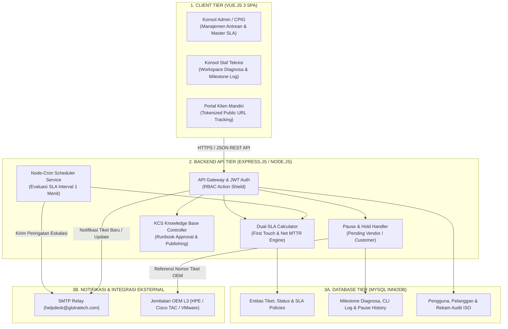
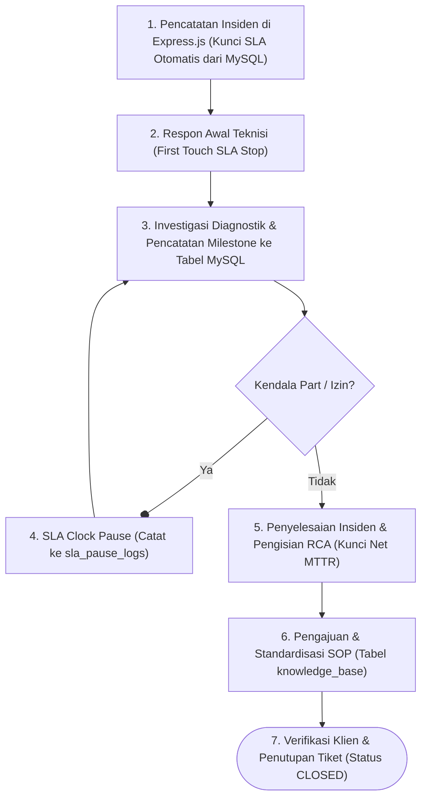

# SPESIFIKASI TEKNIS: ARSITEKTUR SISTEM FULL-STACK HELPDESK
## SISTEM HELPDESK TICKETING ENTERPRISE
### PT GLOBAL TRANSFORMASI TEKNOLOGI

---

| Parameter Dokumen | Keterangan |
|---|---|
| **Nomor Dokumen** | GTT-SPEC-ARCH-2026-01 |
| **Klasifikasi** | Internal Teknis - Terbatas |
| **Standar Rujukan** | ITIL v4 Service Operation & ISO/IEC 20000 |
| **Tech Stack** | Vue 3 (Vite + Pinia) \| Express.js (Node.js) \| MySQL \| SMTP Relay |
| **Tanggal Rilis** | 18 September 2026 |
| **Target Lingkup** | Sistem Helpdesk Ticketing Enterprise (Multi-Client) |

---

## BAB I: RINGKASAN SISTEM & TEKNOLOGI

Sistem Helpdesk Ticketing PT Global Transformasi Teknologi dirancang sebagai aplikasi *full-stack* terintegrasi untuk mengelola insiden infrastruktur teknologi informasi pada 6 mitra korporat skala besar:
1. **PT Bank Central Asia, Tbk (BCA)** - Tier Platinum 24×7
2. **PT Astra Honda Motor (AHM)** - Tier Platinum 24×7
3. **Siloam Hospitals Group** - Tier Gold 8×5
4. **Diskominfo Pemerintah Provinsi Jawa Barat** - Tier Pemerintah Tier-1 (8×5)
5. **PT Telekomunikasi Selular (Telkomsel)** - Tier Platinum 24×7
6. **PT Bank Mandiri (Persero), Tbk** - Tier Platinum 24×7

### Komposisi Teknologi (Tech Stack):
- **Frontend Client (Vue.js 3)**: Single Page Application (SPA) responsif berbasis Vue 3, Vite, Pinia state management, dan Vue Router untuk konsol Admin/CPIG, konsol Staf Teknisi, dan Portal Pelacakan Mandiri Pelanggan.
- **Backend REST API (Express.js / Node.js)**: Menyediakan endpoint API modular, otentikasi JWT, middleware otorisasi RBAC, pengatur logika SLA ganda, dan penjadwal cron berkala (*node-cron*).
- **Basis Data Relasional (MySQL)**: Menyimpan data entitas tiket, milestone diagnosa, histori perubahan status, master data SLA dan pelanggan dengan integritas relasi referensial (InnoDB ACID).
- **Layanan Notifikasi Email (SMTP Relay)**: Mengirimkan surat elektronik resmi korporat untuk notifikasi penerimaan tiket, eskalasi insiden, dan pembaruan teknis ke pihak klien via Nodemailer.

---

## BAB II: DIAGRAM ARSITEKTUR SISTEM FULL-STACK

Arsitektur sistem dibangun secara berlapis (*multi-tier*) yang memisahkan lapisan presentasi antarmuka, pemrosesan logika bisnis, integrasi layanan eksternal, dan lapisan basis data:

### Rincian Tanggung Jawab Komponen

| Lapisan Arsitektur | Spesifikasi Teknologi | Tanggung Jawab Operasional |
|---|---|---|
| **1. Frontend Tier** | Vue 3, Vite, Pinia, Vue Router, Tailwind CSS | Konsol operasional Admin/CPIG, lembar kerja teknisi, dan portal pelacakan status pelanggan berbasis tokenized URL. |
| **2. Backend API Tier** | Express.js (Node.js), JWT, Node-Cron, Nodemailer | Penyedia REST API endpoint, validasi hak akses RBAC, kalkulasi SLA di server, penanganan jeda SLA, dan cron scheduler. |
| **3. Database Tier** | MySQL (InnoDB Engine, ACID Transaksi) | Penyimpanan permanen tiket, riwayat status, audit trail, relasi pelanggan & PKS, serta pustaka knowledge base. |
| **4. Integrasi Surel** | Corporate SMTP Relay Server | Pengiriman otomatis surat konfirmasi tiket, pemberitahuan penugasan teknisi, dan peringatan eskalasi bertingkat. |

---

## BAB III: MATRIKS AKSES BERBASIS PERAN (RBAC)

Sistem menerapkan pembatasan hak akses tegas antara peran **ADMIN / CPIG** dan **SUPPORT ENGINEER** untuk memisahkan wewenang tata kelola dengan tindakan eksekusi perbaikan teknis:

| Modul / Tindakan Operasional | ADMIN / CPIG | SUPPORT ENGINEER | PORTAL KLIEN |
|---|:---:|:---:|:---:|
| Monitoring Dashboard SLA & Antrean Global | **Akses Penuh** | Pantauan Personal | Ditolak |
| Pembuatan Tiket Baru & Pemilihan Preset | **Akses Penuh** | Input Lapangan | Ditolak |
| Penugasan & Alokasi Ulang Staf Teknisi | **Kontrol Penuh** | Hanya Baca | Ditolak |
| **Salin Tautan Pelacakan Klien (Tokenized URL)** | **Akses Khusus** | Disembunyikan | Ditolak |
| **Pratinjau & Pengiriman Surel Notifikasi** | **Akses Khusus** | Disembunyikan | Ditolak |
| Pencatatan Milestone & Command Execution Log | Bisa Menambah | **Pelaksana Utama** | Ditolak |
| Pengajuan & Pencabutan Penahanan SLA (Pause) | Validasi / Cabut | **Pelaksana Utama** | Ditolak |
| Pengisian Analisis Akar Masalah (RCA) & Resolusi | Verifikasi | **Pelaksana Utama** | Ditolak |
| Konfigurasi Matriks SLA & Master Data Pelanggan | **Akses Penuh** | Ditolak (403) | Ditolak |
| Laporan SLA Eksekutif & Ekspor Laporan | **Akses Penuh** | Ditolak (403) | Ditolak |
| Pustaka Runbook Pengetahuan (Knowledge Base) | Persetujuan SOP | Ajukan & Membaca | Hanya Baca |

---

## BAB IV: ALUR OPERASIONAL SIKLUS HIDUP TIKET

Setiap insiden ditangani melalui 6 tahap standar operasional dari penerimaan hingga penutupan resmi:

### Rincian 6 Tahap Operasional:
1. **Pencatatan Insiden & Penguncian Batas Waktu SLA**: Laporan insiden dicatat di sistem Express.js oleh Admin/CPIG. Sistem mengunci target respon dan resolusi secara otomatis dari tabel MySQL sesuai kontrak pelanggan. Email notifikasi dan link token dikirim ke pihak terkait via SMTP.
2. **Respon Awal Teknisi (Response SLA Handshake)**: Teknisi mengubah status tiket menjadi `IN_PROGRESS`. Endpoint API menghentikan timer waktu respon awal (*First Touch SLA*) dan menyimpan timestamp ke database MySQL.
3. **Investigasi Diagnostik & Pencatatan Milestone**: Teknisi melakukan isolasi gangguan. Setiap langkah teknis, catatan observasi, dan riwayat perintah CLI dicatat ke tabel `ticket_milestones` pada basis data.
4. **Penahanan Jam SLA Resmi (SLA Clock Pause)**: Jika perbaikan terhenti akibat menunggu komponen vendor atau jadwal pemeliharaan klien, teknisi mengaktifkan Pause dengan nomor kasus vendor. Backend membekukan penghitungan durasi resolusi.
5. **Penyelesaian Masalah & Analisis Akar Masalah (RCA)**: Setelah sistem normal, teknisi mengisi formulir penyelesaian (Akar Masalah, Tindakan Korektif, dan Rekomendasi). Tiket diubah ke status `RESOLVED` dan waktu resolusi bersih (Net MTTR) dikunci.
6. **Standardisasi Prosedur (Knowledge Base Runbook)**: Prosedur teknis yang berhasil diajukan ke antrean persetujuan Knowledge Base. Setelah disetujui Administrator, artikel diterbitkan sebagai SOP referensi pada sistem.

---

## BAB V: LOGIKA PERHITUNGAN SLA & ESKALASI

### 1. Formula Dual SLA Engine

#### A. Waktu Respon Awal (*First Touch SLA*)
$$\Delta T_{\text{respon}} = T_{\text{respon}} - T_{\text{dibuat}}$$
- **Kepatuhan:** $\Delta T_{\text{respon}} \le \text{Target Respon Kontrak PKS}$

#### B. Waktu Resolusi Bersih (*Net MTTR SLA*)
$$\text{Net MTTR} = (T_{\text{selesai}} - T_{\text{dibuat}}) - \sum T_{\text{pause}}$$
- **Kepatuhan:** $\text{Net MTTR} \le \text{Target Resolusi Kontrak PKS}$

---

### 2. Matriks Standar Kontrak Layanan (PKS)

| Tingkat Kontrak | Cakupan Waktu Layanan | Target Respon | Target Resolusi MTTR |
|---|---|:---:|:---:|
| **Platinum 24×7** | 24 Jam × 7 Hari Non-Stop | $\le$ 30 Menit | $\le$ 4 Jam |
| **Gold 8×5** | Senin – Jumat (08:00 – 17:00 WIB) | $\le$ 30 Menit | $\le$ 8 Jam |
| **Silver 8×5** | Senin – Jumat (08:30 – 17:30 WIB) | $\le$ 1 Jam | $\le$ 12 Jam |
| **Pemerintah Tier-1** | Jam Kerja Kantor Dinas Pemerintah | $\le$ 1 Jam | $\le$ 12 Jam |

---

### 3. Mekanisme Pemicu Eskalasi Otomatis (Node-Cron Service)

Layanan background scheduler di Express.js mengevaluasi persentase sisa waktu SLA setiap interval 1 menit secara terotomasi:

| Tahapan Eskalasi | Ambang Batas Waktu | Tindakan Sistem Otomatis | Penerima Notifikasi |
|---|---|---|---|
| **Tahap 1: Peringatan** | 50% dari Target MTTR | Kirim email pengingat status pengerjaan via SMTP | Teknisi Bertugas & Lead SysOps |
| **Tahap 2: Kritis** | 80% dari Target MTTR | Kirim email alert prioritas tinggi via SMTP | Service Operations Manager |
| **Tahap 3: Pelanggaran** | 100% Target MTTR Terlampaui | Tandai status Breached di database & catat audit log | Manajemen & Komite Operasional |

---

## BAB VI: SKEMA BASIS DATA RELASIONAL (MYSQL SCHEMA)

Penyimpanan data pada MySQL menerapkan normalisasi relasional dengan engine InnoDB untuk mendukung transaksi ACID:

| Nama Tabel | Atribut Kunci Utama | Deskripsi & Relasi Data |
|---|---|---|
| `tickets` | id, ticket_number, customer_id, assigned_to, status, priority, sla_policy_id | Menyimpan entitas tiket utama, status alur kerja, dan foreign key ke pelanggan serta teknisi penanggung jawab. |
| `sla_policies` | id, tier_name, response_time_minutes, resolution_time_minutes, operating_hours | Katalog master SLA kontraktual yang mengatur batas waktu respon dan resolusi sesuai tingkatan PKS. |
| `sla_pause_logs` | id, ticket_id, reason_type, vendor_case_id, paused_at, resumed_at, total_paused_seconds | Merekam histori pembekuan waktu SLA resmi saat menunggu suku cadang principal vendor atau verifikasi klien. |
| `ticket_milestones` | id, ticket_id, title, description, command_executed, created_by, created_at | Catatan kronologis langkah perbaikan teknis dan cuplikan eksekusi perintah terminal selama penanganan. |
| `knowledge_base` | id, kb_number, title, category, target_vendor, runbook_steps, status, approved_by | Repositori artikel panduan teknis (Runbook SOP) yang telah diverifikasi untuk penggunaan berulang. |
| `audit_event_logs` | id, ticket_id, user_id, action_type, old_value, new_value, timestamp | Rekam jejak audit tidak terhapus (immutable) untuk kepatuhan tata kelola standar ISO/IEC 20000. |
