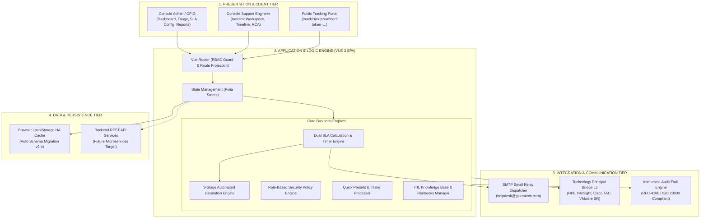
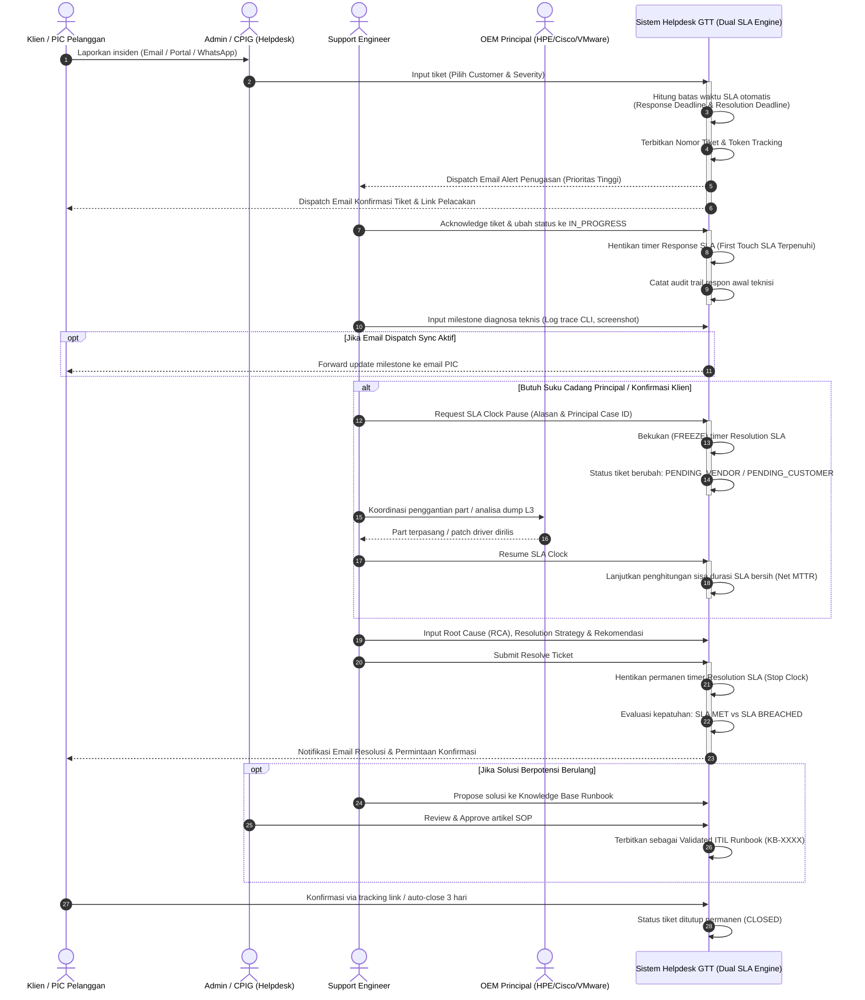
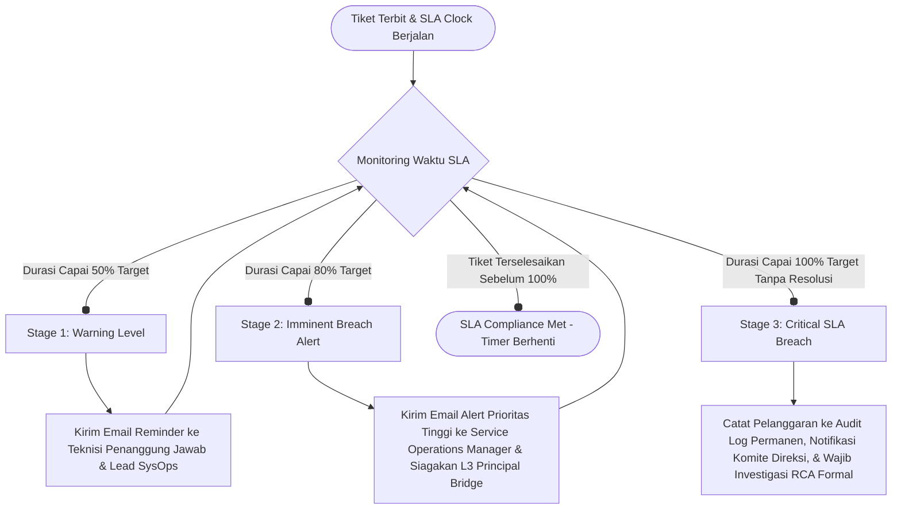

# Arsitektur Sistem & Logical Flow: Helpdesk Ticketing Enterprise PT Global Transformasi Teknologi (GTT)

Dokumen ini disusun sebagai materi presentasi, pengujian sistem, dan diskusi teknis lanjutan bersama stakeholder/penguji. Dokumen ini merangkum arsitektur menyeluruh, matriks kewenangan peran (RBAC), alur logika bisnis penanganan tiket, serta mekanisme *Dual SLA Engine*.

---

## 1. Ringkasan Eksekutif & Karakteristik Sistem

Aplikasi Helpdesk Ticketing PT Global Transformasi Teknologi (GTT) dirancang menggunakan standar tata kelola **ITIL v4 Service Operation** untuk mengelola infrastruktur data center multi-vendor *(HPE, VMware, Cisco, Brocade, Rubrik, Oracle)* pada 6 klien korporat tier-enterprise.

### Pilar Utama Solusi:
1. **Dynamic Contractual SLA Engine**: Target waktu *Response SLA* (First Touch) dan *Resolution SLA* (Net MTTR) dikalkulasi secara otomatis berdasarkan tier kontrak PKS klien (Platinum 24x7, Gold 8x5, Silver, Government Tier-1) tanpa input manual operator.
2. **Dual SLA Clock & Audit Pause**: Mendukung mekanisme penahanan jam kerja resmi (*SLA Clock Pause*) saat menunggu ketersediaan suku cadang principal vendor atau konfirmasi pelanggan.
3. **Strict Enterprise RBAC**: Pemisahan peran yang tegas antara **ADMIN / CPIG** (triage, penugasan, master data, customer liaison) dan **SUPPORT ENGINEER** (penanganan teknis, timeline diagnosa, RCA, resolusi).
4. **Email Relay Dispatcher**: Seluruh alert eskalasi tiket baru, milestone update, dan SLA breach warning dikirimkan melalui **Email Relay resmi korporat**.
5. **Integrated ITIL Runbook Knowledge Base**: Solusi dari tiket yang terselesaikan dapat langsung diajukan menjadi panduan SOP teknis terverifikasi.

---

## 2. Diagram Arsitektur Sistem (Multi-Tier Architecture)

---

## 3. Matriks Hak Akses Peran (Role-Based Access Control)

Sistem menerapkan prinsip *Least Privilege* dengan 2 peran internal dan 1 mode akses publik klien:

| Fitur / Modul Sistem | ADMIN / CPIG | SUPPORT ENGINEER | CUSTOMER (Tokenized) |
|---|:---:|:---:|:---:|
| **Mission Control Dashboard** (`/dashboard`) | Full Telemetry & All Roster | Personal Shift Telemetry | Tidak Ada Akses |
| **Penerbitan Tiket Baru** (`/tickets/create`) | Full Form & Quick Presets | Create on Incident | Tidak Ada Akses |
| **Alokasi / Reassign Teknisi** | Full Control | Read-Only | Tidak Ada Akses |
| **Bagikan Link Customer** | **Akses Penuh** | Disembunyikan | Tidak Ada Akses |
| **Pratinjau Email Notifikasi** | **Akses Penuh** | Disembunyikan | Tidak Ada Akses |
| **Toggle Email Dispatch Sync** | **Bisa Ubah ON/OFF** | Status Read-Only | Tidak Ada Akses |
| **Tambah Milestone Diagnosa** | Boleh Menambah | **Aktor Utama** | Tidak Ada Akses |
| **Request / Resume SLA Pause** | Validasi & Eksekusi | **Aktor Utama** | Tidak Ada Akses |
| **Resolve & Form RCA / Solusi** | Verifikasi & Resolve | **Aktor Utama** | Tidak Ada Akses |
| **Konfigurasi Matriks SLA** (`/admin/sla-configuration`) | **Akses Penuh (Edit/Add)** | Akses Ditolak (403) | Tidak Ada Akses |
| **Manajemen Klien & PIC** (`/admin/customers`) | **Akses Penuh** | Akses Ditolak (403) | Tidak Ada Akses |
| **Manajemen Staf** (`/admin/users`) | **Akses Penuh** | Akses Ditolak (403) | Tidak Ada Akses |
| **Ekspor Laporan Eksekutif** (`/reports`) | **Akses Penuh (Cetak/Excel)** | Akses Ditolak (403) | Tidak Ada Akses |
| **Knowledge Base Runbooks** (`/knowledge-base`) | Approve & Publish | Propose & Read | Read-Only SOP Terkait |
| **Portal Pelacakan Tiket** (`/track/:ticketNumber`) | Monitoring View | Monitoring View | **Akses Penuh Mandiri** |

---

## 4. Logical Flow: Siklus Hidup Penanganan Tiket (End-to-End)

---

## 5. Logika Mesin SLA (*Dual SLA Engine*) & Formula Kalkulasi

Sistem menggunakan **Dual SLA Engine** terpisah untuk mengukur performa secara objektif:

### A. Response SLA Engine (Kecepatan Kontak Pertama)
* Mengukur durasi sejak tiket dibuat ($T_{\text{created}}$) hingga teknisi merespon pertama kali ($T_{\text{responded}}$).
$$\Delta T_{\text{response}} = T_{\text{responded}} - T_{\text{created}}$$
* **Kriteria Sukses**: $\Delta T_{\text{response}} \le \text{Target Response SLA}$ (misal 30 menit).

### B. Resolution SLA Engine (Durasi Pemulihan Bersih / Net MTTR)
* Mengukur total waktu penyelesaian bersih dengan mengecualikan durasi penahanan yang sah (*Legitimate Pause Duration*):
$$\text{Net MTTR} = (T_{\text{resolved}} - T_{\text{created}}) - \sum T_{\text{paused}}$$
* **Kriteria Sukses**: $\text{Net MTTR} \le \text{Target Resolution SLA}$ (misal 4 jam).

### C. Matriks Batas Waktu Berdasarkan Tier Kontrak (Enforceable MSA)
| Tier Kontrak | Jendela Operasional | Target Response | Target Resolution | Penalti Keterlambatan |
|---|---|:---:|:---:|---|
| **Platinum 24x7** | 24 Jam × 7 Hari (Non-Stop) | $\le$ 30 Menit | $\le$ 4 Jam | 5% Service Credit / jam |
| **Gold 8x5** | Senin – Jumat (08:00 – 17:00 WIB) | $\le$ 30 Menit | $\le$ 8 Jam | 3% Service Credit / jam |
| **Silver 8x5** | Senin – Jumat (08:30 – 17:30 WIB) | $\le$ 1 Jam | $\le$ 12 Jam | Standard SLA Credit |
| **Government Tier-1** | Jam Kerja Kantor Pemda (8x5) | $\le$ 1 Jam | $\le$ 12 Jam | Laporan Audit BPKP |

---

## 6. Alur Eskalasi Otomatis 3 Tahap (Automated Escalation Triggers)

---

## 7. Poin Diskusi & Tanya Jawab Lanjutan (Q&A Cheatsheet)

Saat mempresentasikan sistem ini kepada penguji/stakeholder, gunakan poin-poin berikut:

1. **Mengapa tidak menggunakan notifikasi WhatsApp otomatis?**
   - *Jawaban*: Mengikuti standar kepatuhan korporat dan audit enterprise, media komunikasi resmi untuk eskalasi kontrak PKS dan SLA enforceable adalah **Email Relay korporat** (*helpdesk@glotratech.com*). Email menyediakan *tamper-proof delivery receipts*, lampiran log formal, dan kepatuhan arsip legal. WhatsApp tetap dapat difungsikan sebagai saluran penerima keluhan awal (*Customer Intake*).

2. **Bagaimana sistem menjamin keamanan pelacakan customer tanpa login?**
   - *Jawaban*: Sistem menggunakan arsitektur **Tokenized URL** (contoh: `/track/TICK-20260913-0001?token=sec_ahm_9912a7f8`). Token di-generate secara kriptografis dan terikat dengan ID tiket serta PIC terdaftar, mencegah enumerasi URL oleh pihak luar tanpa membebani klien dengan keharusan menghafal akun/kata sandi.

3. **Bagaimana penanganan pause SLA agar tidak disalahgunakan oleh teknisi?**
   - *Jawaban*: Penahanan waktu SLA wajib memilih klasifikasi (*Pending Vendor Principal* atau *Pending Customer Verification*), mencantumkan nomor tiket principal resmi (contoh: *HPE Case ID / Cisco TAC Case*), dan setiap aksi pause/resume tercatat permanen di dalam **Audit Trail Log** yang tidak dapat diedit atau dihapus.

4. **Bagaimana hubungan antara tiket insiden dan modul Knowledge Base?**
   - *Jawaban*: Sistem menerapkan siklus *Knowledge-Centered Service (KCS)*. Saat tiket insiden selesai, teknisi dapat menandai *"Propose for Knowledge Base"*. Supervisor/Admin kemudian memvalidasi langkah kerja dan CLI syntax tersebut sebelum dipublikasikan menjadi **ITIL Runbook SOP resmi** yang dapat dipakai berulang oleh teknisi lain.
