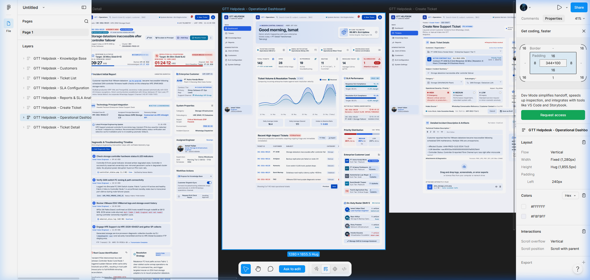
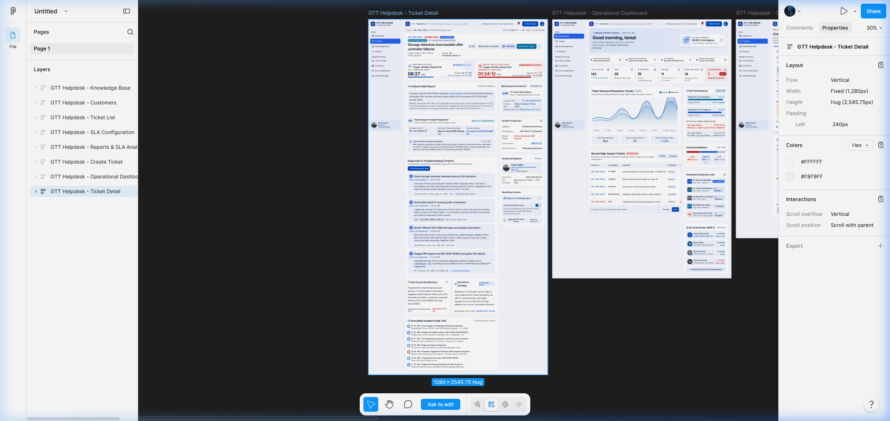
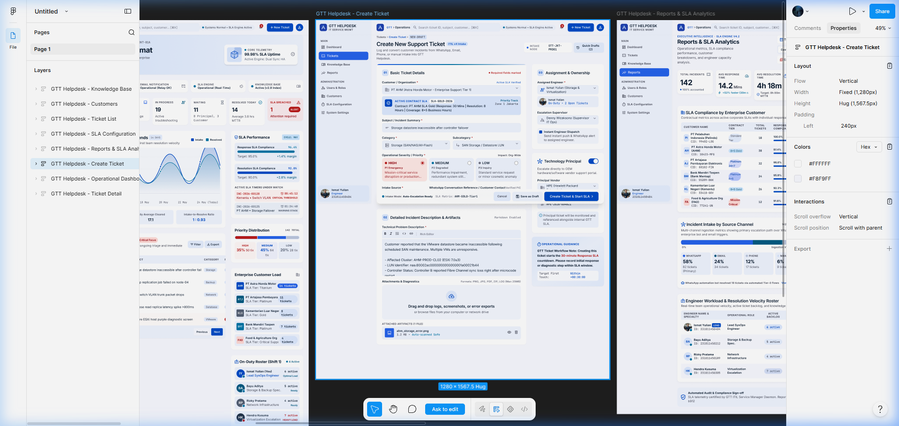
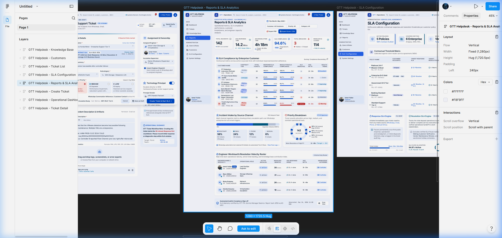
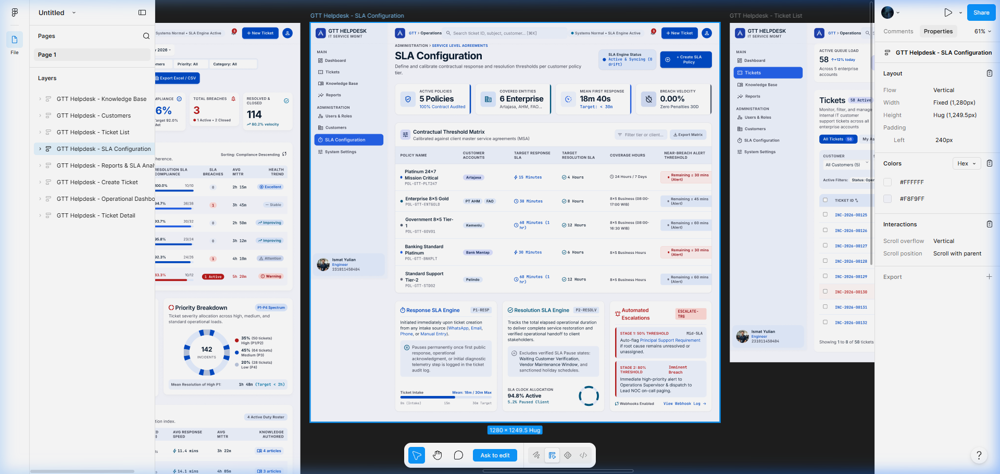
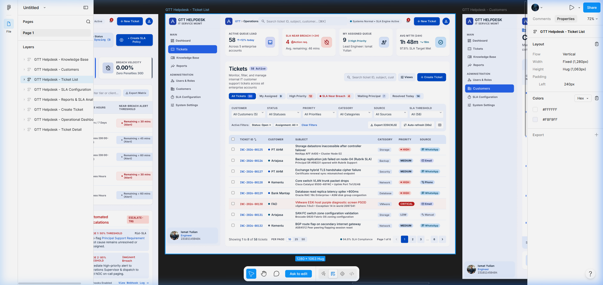
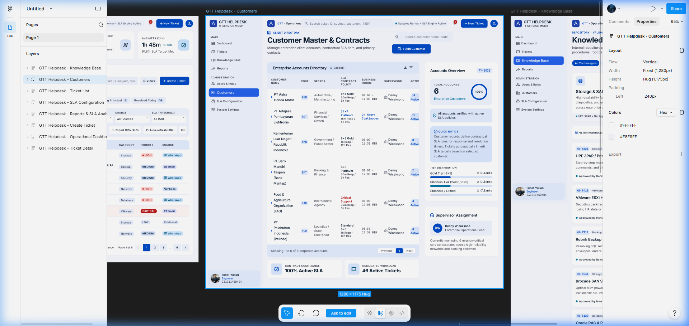
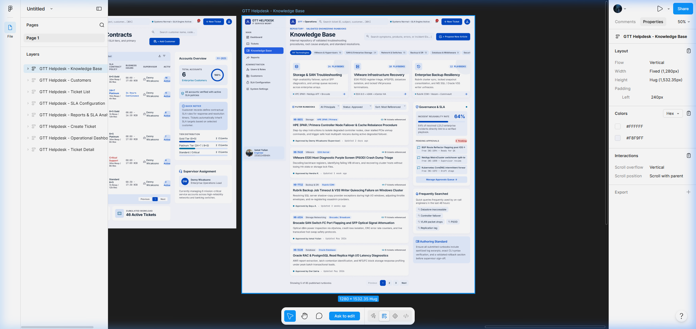

# Analisis Komprehensif & Komparasi Prototype Figma
## Sistem Helpdesk & IT Service Management (ITSM) — PT Global Transformasi Teknologi (GTT)

Dokumen ini mendokumentasikan hasil analisis desain antarmuka, arsitektur informasi, serta perbandingan mendalam antara **Prototype Desain Figma (ITSM High-Density)** dengan **Implementasi Kode Sistem yang Sedang Berjalan (*Current State*)**.

---

### 📌 Metadata Referensi Figma
* **Figma File URL**: `https://www.figma.com/design/InsNYRwz7PYJ3Ue4hXpSKs/Untitled?node-id=0-1&m=dev&t=tZS6G9tACsvzPGX3-1`
* **Prototype URL**: `https://www.figma.com/proto/InsNYRwz7PYJ3Ue4hXpSKs/Untitled?node-id=1-1903&p=f&t=cHPKfxsTgsZO1Sdm-1&scaling=min-zoom&content-scaling=fixed&page-id=0%3A1`
* **Waktu Analisis**: September 2026
* **Jumlah Layar**: 8 Layar Utama (*Full High-Fidelity UI Screens*)
* **Direktori Berkas Media**: `docs/figma-analysis/screenshots/` dan `frontend/public/figma-reference/`

---

## 1. Ringkasan Eksekutif Perubahan Desain

Perubahan dari sistem lama menuju prototype desain Figma merepresentasikan evolusi dari **Sistem Helpdesk Tiket Standar** menjadi **Platform Enterprise IT Service Management (ITSM) & Mission Control Console** berstandar korporat ITIL.

| Parameter | Sistem Saat Ini (*Current Codebase*) | Prototype Desain Figma Baru |
| :--- | :--- | :--- |
| **Identitas Visual** | Slate Blue (`#1E40AF` / `#2563EB`) & Soft Slate Off-White (`#F8FAFC`). Bersih, minimalis, dan fungsional. | **Navy Deep Slate + Electric Blue Accent (`#0066FF` / `#0F172A`)** dengan aksen telemetri hijau/oranye/merah dan densitas informasi tinggi (*dense enterprise layout*). |
| **Struktur Navigasi** | Antrean tiket dan grafik dashboard digabungkan dalam 1 halaman gulir panjang (`DashboardView.vue`). | **Pemisahan tegas**: Antrean tiket memiliki halaman mandiri (**Ticket List**), sementara **Dashboard** murni sebagai *Operational Mission Control*. |
| **Modul Baru** | Fitur konfigurasi SLA belum memiliki halaman tersendiri (bersifat statis/hardcoded). | Modul baru terdedikasi: **SLA Configuration** (manajemen matriks SLA multi-tier & aturan eskalasi bertingkat). |
| **Integrasi L3 Prinsipal** | Pencatatan riwayat tiket terbatas pada staf internal GTT. | Dilengkapi panel khusus **Technology Principal Integration** (eskalasi langsung ke vendor OEM internasional: HPE, Cisco, VMware, Oracle). |
| **Basis Pengetahuan** | Artikel FAQ solusi umum. | **Validated Engineering Runbooks** dengan metrik reusabilitas insiden (*Reusability Rate: 64%*), antrean persetujuan (*Pending Approvals*), dan *Runbook Authoring Standards*. |

---

## 2. Rincian 8 Layar Prototype Figma & Komparasi

### Layar 1: Operational Dashboard (Mission Control Console)


* **Fitur Utama pada Desain Figma:**
  * **Header Mission Control**: Menampilkan salam personal (*"Good morning, Ismat"*), node aktif (`NODE-JKT-01A`), dan ringkasan **Core Telemetry Uptime (99.98%)** dengan status *real-time* 4 layanan sistem (Ticketing, Email, SLA Engine, Knowledge Base).
  * **6 Kartu Ringkasan Metrik**: *Total Tickets (142)*, *Open (28)*, *In Progress (19)*, *Waiting (11)*, *Resolved Today (14)*, dan kartu merah kritis *SLA Breached (1)*.
  * **Grafik Dual-Stream Tren Insiden (14 Hari)**: Menampilkan perbandingan dinamis antara tiket masuk (*Intake*) vs terselesaikan (*Resolved*) lengkap dengan metrik kecepatan (*Intake-to-Resolve Ratio 1:0.93*).
  * **Active SLA Timers Under Watch**: Kartu khusus hitung mundur (*countdown*) langsung untuk tiket-tiket berisiko tinggi (*Near Breach Warning*).
  * **Enterprise Customer Load & On-Duty Roster**: Pemetaan beban tiket per klien korporat (Astra Honda, Artajasa, Kemenlu) serta roster jadwal shift teknisi lengkap dengan kapasitas beban kerja (*Optimal, Ready, Heavy Load*).
* **Komparasi dengan Sistem Saat Ini:**
  * Dashboard saat ini sudah memiliki grafik SVG interaktif dan metrik MTTR, tetapi antrean tabel tiket masih menempel di bawah grafik.
  * Dashboard saat ini belum memiliki panel *Core Telemetry*, *Active SLA Timers*, dan *On-Duty Roster*.

---

### Layar 2: Ticket Detail View (High-Density Incident Response)


* **Fitur Utama pada Desain Figma:**
  * **Dual Live SLA Countdown di Header**:
    * *Response SLA*: Target 30 Menit &rarr; Berhasil direspon dalam 12 Menit.
    * *Resolution SLA Countdown*: Target 8 Jam &rarr; Sisa waktu berjalan: **`01:24:12 HRS`** dengan badge peringatan kuning/merah *Near Breach Warning*.
  * **Technology Principal Integration (Eskalasi L3 OEM)**: Card terintegrasi vendor prinsipal (Hewlett Packard Enterprise / HPE InfoSight API), memuat *Principal Case ID*, nama spesialis prinsipal (*Marcus Vance*), dan pembaruan berkala dari vendor.
  * **Diagnostic & Troubleshooting Timeline**: Milestone penanganan teknis disertai lampiran berkas bukti (*Attachment & Telemetry Logs*) langsung di tiap langkah.
  * **Root Cause Identification & Resolution Strategy**: Blok terstruktur yang membedakan investigasi penyebab utama teknis dengan strategi perbaikan permanen sebelum tiket diselesaikan.
  * **Workflow Actions Sidebar**: Opsi pengusulan ke Knowledge Base, switch sinkronisasi otomatis ke WhatsApp grup klien (*Customer Dispatch Sync*), dan tombol penahanan SLA (*Request SLA Clock Pause*).
* **Komparasi dengan Sistem Saat Ini:**
  * Sistem saat ini sudah memiliki milestone checkpoint, pratinjau berkas lightbox/terminal log, dan tombol jeda SLA (*Pause/Resume*).
  * Desain Figma menambahkan pemisahan formal antara *Root Cause* dan *Resolution Strategy*, integrasi prinsipal L3, serta *Dual Countdown Header*.

---

### Layar 3: Create Support Ticket (3-Step Guided Workflow)


* **Fitur Utama pada Desain Figma:**
  * **Alur Bertahap Terstruktur (*Multi-Section Stepper*)**:
    * **01 Basic Ticket Details**: Pemilihan instansi yang langsung menampilkan badge kontrak aktif (*SLA-GOLD-2026, 30m Response / 8h Resolution*), kategori berjenjang, dan kartu pilihan *Operational Severity* yang jelas (High, Medium, Low).
    * **02 Detailed Incident Description & Artifacts**: Rich text editor untuk deskripsi teknis insiden, dilengkapi area unggah drag-and-drop dengan badge verifikasi keamanan berkas (*Auto-scanned Safe*).
    * **03 Assignment & Ownership**: Penugasan teknisi dengan informasi beban aktif (*2 Open Tickets*), supervisor operasional, tombol notifikasi instan via WhatsApp, dan **switch eskalasi ke vendor prinsipal (Technology Principal)**.
    * **Sidebar Pemandu Operasional**: Callout informatif yang memperingatkan petugas bahwa pembuatan tiket akan langsung memulai penghitungan Response SLA 30 menit.
* **Komparasi dengan Sistem Saat Ini:**
  * Sistem saat ini menggunakan satu formulir panjang dengan fitur deteksi duplikasi (*Smart Ingestion*) dan pembuatan kategori on-the-fly.
  * Desain Figma menyajikan formulir yang lebih terorganisir per bagian dan langsung mengaitkan kontrak SLA klien secara visual.

---

### Layar 4: Reports & SLA Analytics (Executive SLA Intelligence)


* **Fitur Utama pada Desain Figma:**
  * **Matriks Kepatuhan SLA per Klien**: Tabel menyeluruh yang merinci performa setiap mitra korporat: Tier kontrak, total tiket, Response SLA %, Resolution SLA %, total pelanggaran (*Breaches*), MTTR, dan indikator tren kesehatan (*Health Trend: Excellent, Stable, Improving, Attention, Warning*).
  * **Porsi Saluran Pelaporan (*Incident Intake by Source Channel*)**: Komposisi pengaduan melalui WhatsApp (58%), Email (24%), Telepon (12%), dan Manual (6%).
  * **Priority Breakdown Donut Chart**: Distribusi insiden P1 High (35%), P2 Medium (45%), dan P3 Low (20%).
  * **Engineer Workload & Resolution Velocity Roster**: Tabel kecepatan dan produktivitas teknisi (tiket aktif, terselesaikan, MTTR rata-rata, artikel KB yang ditulis).
  * **Tanda Tangan Kepatuhan Audit**: Blok *Automated Audit & Compliance Sign-off* di bagian bawah laporan.
* **Komparasi dengan Sistem Saat Ini:**
  * Sistem saat ini sudah memiliki filter periode fleksibel dan ekspor CSV standar RFC-4180.
  * Desain Figma menambahkan metrik evaluasi per mitra korporat yang sangat representatif untuk rapat evaluasi layanan (*Monthly SLA Review Meeting*).

---

### Layar 5: SLA Configuration (Modul Baru — Manajemen Matriks Kontrak)


* **Fitur Utama pada Desain Figma:**
  * **Contractual Threshold Matrix**: Tabel konfigurasi kebijakan SLA multi-tier:
    * *Platinum 24x7 Mission Critical*: 15m Response / 4h Resolution / 24x7.
    * *Enterprise 8x5 Gold*: 30m Response / 8h Resolution / Jam Kerja 08:00 - 17:00 WIB.
    * *Government 8x5 Tier-1*: 60m Response / 12h Resolution.
    * *Banking Standard Platinum*: 30m Response / 6h Resolution.
  * **Dual SLA Engine Logic**:
    * *Response SLA Engine*: Dimulai otomatis saat tiket terbit, berhenti saat ada respon pertama/diagnosa.
    * *Resolution SLA Engine*: Menghitung total durasi kerja, mengesampingkan status jeda yang sah (*Waiting Customer Verification / Vendor Maintenance*).
  * **Aturan Eskalasi Otomatis (*Automated Escalations*)**:
    * *Stage 1 (50% SLA)*: Menandai tiket membutuhkan asistensi *Principal Support*.
    * *Stage 2 (80% SLA - Imminent Breach)*: Membunyikan pager on-call Lead NOC dan eskalasi ke supervisor.
* **Komparasi dengan Sistem Saat Ini:**
  * **Modul ini belum ada di sistem saat ini**. Menambahkan halaman ini memberikan fleksibilitas penuh dalam mengelola variasi kontrak SLA klien GTT.

---

### Layar 6: Ticket List (Modul Baru — Dedicated Queue Monitor)


* **Fitur Utama pada Desain Figma:**
  * **4 Kartu Metrik Antrean**: *Active Queue Load (58)*, *SLA Near Breach (<2h) (4)*, *My Assigned Queue (9)*, dan *Avg MTTR 24H (1h 48m)*.
  * **Tab Filter Cepat (*Pill Tabs*)**:
    * *All Tickets (58)*
    * *My Assigned (9)*
    * *High Priority (12)*
    * *SLA Near Breach (4)*
    * *Waiting Principal (7)*
    * *Resolved Today (14)*
  * **Bilah Filter Lengkap & Auto-Refresh**: Filter Customer, Status, Priority, Category, Source, dan SLA Threshold dengan toggle *Auto-refresh (30s)*.
  * **Highlight Visual Baris Berisiko**: Baris tiket berisiko tinggi diberi sorotan visual khusus agar petugas sigap mengambil tindakan.
* **Komparasi dengan Sistem Saat Ini:**
  * Memindahkan tabel tiket dari Dashboard ke halaman `/tickets` terpisah akan meningkatkan efisiensi navigasi teknisi secara signifikan.

---

### Layar 7: Customers Management (Customer Master & Contracts)


* **Fitur Utama pada Desain Figma:**
  * **Enterprise Accounts Directory**: Tabel direktori klien lengkap dengan kode instansi, sektor industri, paket SLA, jam layanan (8x5 vs 24x7), supervisor yang ditugaskan, dan jumlah tiket aktif.
  * **Sidebar Ikhtisar Portofolio Akun**: Persentase kepatuhan kontrak (*100% Active SLA Policies*), distribusi tier (Gold, Platinum, Standard), dan kartu penugasan supervisor akun.
* **Komparasi dengan Sistem Saat Ini:**
  * Sistem saat ini menyajikan data customer dalam bentuk kartu profil mitra dan kontak PIC darurat di `/admin/customers`.
  * Desain Figma menonjolkan aspek legalitas kontrak MSA dan parameter SLA.

---

### Layar 8: Knowledge Base (Validated Engineering Runbooks)


* **Fitur Utama pada Desain Figma:**
  * **Katalog Runbook Teknis Tingkat Lanjut**: Repositori prosedur penanganan insiden infrastruktur enterprise (misal: *HPE 3PAR / Primera Controller Node Failover*, *VMware ESXi Host PSOD Crash Dump Triage*, *Rubrik Backup Timeout & VSS Writer Failure*, *Brocade SAN Switch FC Flapping*).
  * **Metrik & Tata Kelola Basis Pengetahuan**:
    * *Incident Reusability Rate*: 64% tiket L2/L3 teratasi berkat panduan runbook.
    * *Pending Approvals Queue*: Alur moderasi artikel baru sebelum dipublikasikan.
    * *Authoring Standards Callout*: Panduan standarisasi log bersih dan langkah pemulihan (*rollback procedure*).
* **Komparasi dengan Sistem Saat Ini:**
  * Knowledge Base saat ini masih berupa artikel panduan umum. Transformasi menjadi katalog runbook teknis berlabel vendor prinsipal akan sangat bernilai untuk akreditasi teknisi.

---

## 3. Fitur Unggulan Sistem Saat Ini yang Wajib Dipertahankan

Prototype Figma berfokus pada pengalaman staf internal. Terdapat beberapa fitur yang **sudah ada di kode saat ini dan tidak boleh dihilangkan**:

1. **Portal Pelacakan Mandiri Publik Pelanggan (`/track/:ticketNumber?token=...`)**:
   * Pelanggan dapat memantau progres perbaikan secara mandiri tanpa login melalui tautan resmi bertoken anti-IDOR, lengkap dengan tombol konfirmasi pemulihan layanan atau eskalasi ke WhatsApp Helpdesk.
2. **Jejak Audit Keamanan Penuh (`/audit-logs`)**:
   * Mencatat setiap aksi staf, perubahan data, pause/resume SLA, dan pengalihan status dengan kemampuan ekspor CSV/JSON RFC-4180.
3. **Pemeriksaan Duplikasi Cerdas (*Smart Ingestion Check*)**:
   * Mencegah penerbitan tiket ganda saat pelanggan melaporkan kendala yang sedang ditangani.
4. **Penyederhanaan Role-Based Access Control (RBAC)**:
   * Menghilangkan peran pasif (*Management*) dan menyederhanakan arsitektur hak akses menjadi **2 Peran Internal + 1 Peran Eksternal**:
     * **ADMIN / CPIG (Internal)**: Pengendali penuh sistem, gatekeeper penerimaan laporan, pembuatan tiket, penugasan teknisi (*dispatching*), pengawasan metrik SLA korporat, konfigurasi SLA, serta pengelolaan master data dan jejak audit.
     * **ENGINEER (Internal)**: Teknisi pelaksana penanganan gangguan teknis, pengisian milestone diagnosa, jeda SLA (*pause/resume*), dan penyelesaian tiket (*resolve*).
     * **CUSTOMER (Eksternal)**: Mitra pengguna layanan yang mengakses portal pelacakan mandiri (*self-service tracking*) berbasis token unik tanpa perlu login akun staf.

---

## 4. Rekomendasi Roadmap Implementasi Bertahap

```
[FASE 1: Navigasi & Antrean Tiket]
├── Buat rute dan halaman mandiri TicketListView.vue (/tickets)
└── Restrukturisasi DashboardView.vue menjadi Mission Control (Core Telemetry, Active SLA Timers, On-Duty Roster)

[FASE 2: Tiket Detail & Pembuatan Tiket]
├── Lengkapi TicketDetailView.vue dengan Dual Countdown, Root Cause & Resolution Strategy
└── Tata ulang CreateTicketView.vue menjadi 3-Step Guided Form dengan ringkasan kontrak SLA

[FASE 3: Konfigurasi SLA & Master Data]
├── Tambahkan modul baru SlaConfigurationView.vue (/sla-configuration)
├── Perbarui CustomersManagementView.vue dengan matriks kontrak MSA
└── Perkaya KnowledgeBaseView.vue dengan katalog Engineering Runbooks ITIL
```

---

*Dokumen disusun dan diverifikasi secara otomatis pada lingkungan kerja repositori Ticketing-helpdesk PT Global Transformasi Teknologi.*
